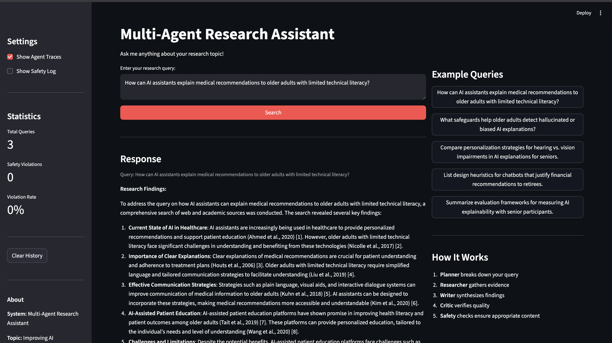
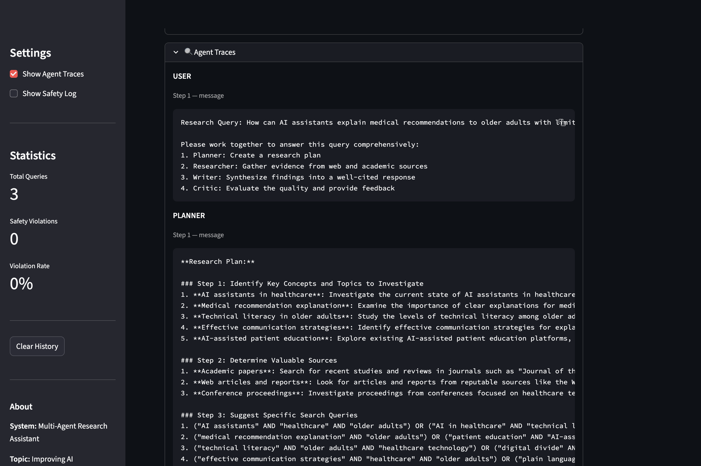
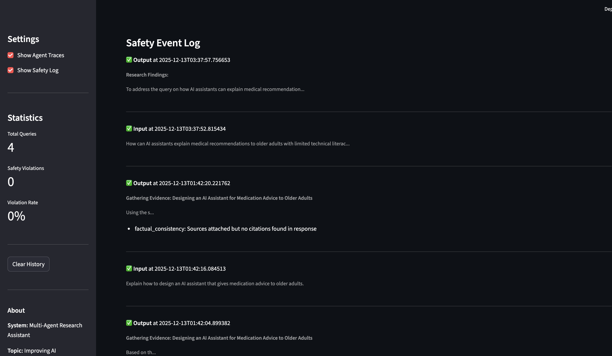

[](https://classroom.github.com/a/r1tAQ0HC)

# Multi-Agent Research Assistant – Assignment 3

Multi-agent research assistant for the topic **“Improving AI Explainability for Older Adults”**, built with AutoGen agents, safety guardrails, a Streamlit web UI, and an LLM-as-a-Judge evaluation pipeline.

This README is written to match the assignment expectations and to make it easy to reproduce the results in the accompanying report.

---

## 1. System Overview

The system orchestrates four AutoGen agents to answer HCI research questions:

- **Planner** – breaks down the user’s query into a structured research plan.
- **Researcher** – gathers evidence (conceptually via web/paper search tools).
- **Writer** – synthesizes findings into a final answer with inline citations and a references section.
- **Critic** – reviews the draft for relevance, completeness, and clarity.

Additional components:

- **Safety guardrails** (input + output) implemented in `src/guardrails/`, with logging and UI surfacing of safety events.
- **LLM-as-a-Judge** evaluation pipeline in `src/evaluation/` using a Groq-hosted model and multiple criteria.
- **User interfaces**:
  - Streamlit web UI (`src/ui/streamlit_app.py`)
  - CLI (`src/ui/cli.py`) for terminal-based interaction.

---

## 2. Repository Structure

Key files and directories:

```text
.
├── main.py                  # Entry point: CLI / web / evaluation
├── config.yaml              # System, agents, models, safety, evaluation
├── data/
│   └── test_queries.json    # Evaluation dataset (8 HCI queries)
├── outputs/
│   ├── Final eval.json      # Saved evaluation run with judge outputs + traces
│   └── FinalEval.csv        # Per-query judge scores (CSV)
├── src/
│   ├── autogen_orchestrator.py  # Multi-agent workflow over AutoGen
│   ├── agents/
│   │   └── autogen_agents.py    # Planner, Researcher, Writer, Critic
│   ├── guardrails/
│   │   ├── safety_manager.py    # Orchestrates input/output guardrails
│   │   ├── input_guardrail.py   # Input policy checks + sanitization
│   │   └── output_guardrail.py  # Output policy checks + sanitization
│   ├── tools/
│   │   ├── web_search.py        # Web search tool (Brave/Tavily-style)
│   │   └── paper_search.py      # Paper search tool (Semantic Scholar)
│   ├── evaluation/
│   │   ├── judge.py             # LLM-as-a-Judge (Groq client + prompts)
│   │   └── evaluator.py         # Batch evaluation + reporting
│   └── ui/
│       ├── cli.py               # Interactive CLI interface
│       └── streamlit_app.py     # Web UI (Streamlit)
├── requirements.txt             # Python dependencies
└── .env.example                 # Template for API keys
```

---

## 3. Setup & Installation

### 3.1. Prerequisites

- Python **3.9+**
- Recommended: virtual environment (e.g., `python -m venv venv`)
- A Groq API key (or compatible OpenAI-style key) for LLM calls

### 3.2. Create and activate a virtual environment

```bash
python -m venv venv
source venv/bin/activate        # macOS/Linux
# or
venv\Scripts\activate           # Windows
```

### 3.3. Install dependencies

```bash
pip install -r requirements.txt
```

### 3.4. Configure API keys

1. Copy the example environment file:

   ```bash
   cp .env.example .env
   ```

2. Edit `.env` and fill in the relevant keys:

   ```bash
   # Required: at least one LLM API
   GROQ_API_KEY=your_groq_api_key_here
   # or
   OPENAI_API_KEY=your_openai_api_key_here

   # Optional: search / paper APIs (if used by tools)
   BRAVE_API_KEY=your_brave_api_key_here
   TAVILY_API_KEY=your_tavily_api_key_here
   SEMANTIC_SCHOLAR_API_KEY=your_semantic_scholar_key_here
   ```

3. Confirm that `config.yaml` matches your chosen provider (default is Groq).

---

## 4. Running the System

### 4.1. Web UI (Streamlit)

This is the main demo for the assignment.

```bash
python main.py --mode web
# (equivalent to)
# streamlit run src/ui/streamlit_app.py
```

Then open the URL printed by Streamlit (typically http://localhost:8501).

In the UI you can:

- Enter a free-form research query in the text area.
- See the **final synthesized answer** with headings and inline citations like `[Source: ...]`.
- Expand **“Citations”** to view a separate list of sources/URLs.
- Toggle **“Show Agent Traces”** to see the Planner/Researcher/Writer/Critic messages.
- Toggle **“Show Safety Log”** to view recent safety events and policy violations.
- See a **Quality Score** metric computed from metadata (num_sources, critique, messages).

### 4.2. Command-line interface (CLI)

```bash
python main.py --mode cli
```

Features:

- Interactive text loop for entering queries.
- Shows final response, extracted URLs, and basic metadata.
- Prints safety information (sanitized input/output, violations, and recent safety events).

### 4.3. One-command end-to-end evaluation (LLM-as-a-Judge)

This runs the full pipeline: **queries → multi-agent system → final answer → judge scoring** and stores the results in `outputs/`.

```bash
python main.py --mode evaluate
```

What this does:

1. Loads the evaluation dataset from `data/test_queries.json`.
2. For each query:
   - Runs the AutoGen-based orchestrator (`AutoGenOrchestrator`) to get a final answer + citations + conversation history.
   - Calls the **LLMJudge** in `src/evaluation/judge.py` to score the answer on multiple criteria.
3. Aggregates scores and writes:
   - `outputs/evaluation_<timestamp>.json` – full judge outputs + metadata.
   - `outputs/evaluation_<timestamp>.csv` – per-query numeric scores.
   - `outputs/evaluation_summary_<timestamp>.txt` – human-readable summary.

This repo already includes one completed run:

- `outputs/Final eval.json` – representative evaluation JSON (8 queries).
- `outputs/FinalEval.csv` – the corresponding per-query scores.

You can cite these files directly in your report as the “official” evaluation run.

---

## 5. Queries Used for Evaluation

All evaluation experiments in the repo use the dataset in `data/test_queries.json`, focused on **explainable AI and older adults**. The eight test queries are:

1. How can AI assistants explain medical recommendations to older adults with limited technical literacy?
2. What are effective multimodal explanation techniques for older adults using smart home systems?
3. Summarize evaluation frameworks for measuring AI explainability with senior participants.
4. How do cultural backgrounds influence the preferred explanation style among older adults interacting with AI tutors?
5. What safeguards help older adults detect hallucinated or biased AI explanations?
6. Compare personalization strategies for tailoring AI explanations to older adults with hearing vs. vision impairments.
7. What training datasets or user studies exist that focus on explainable AI for people over 65?
8. List design heuristics for chatbots that must justify financial recommendations to retirees.

These are the same queries used in:

- The **Streamlit demo** (you can paste any of them into the UI).
- The **evaluation run** whose results are stored in `outputs/Final eval.json` and `outputs/FinalEval.csv`.

---

## 6. Multi-Agent Workflow & Sources

### 6.1. AutoGen workflow

Implementation: `src/autogen_orchestrator.py` and `src/agents/autogen_agents.py`.

- The **Planner**, **Researcher**, **Writer**, and **Critic** agents are implemented as AutoGen `AssistantAgent`s and combined into a `RoundRobinGroupChat`.
- The orchestrator:
  - Constructs a structured task message (query + instructions).
  - Runs the team until a termination token (`TERMINATE`) is produced.
  - Extracts:
    - `conversation_history` (full agent messages).
    - A final synthesized response.
    - A research **plan**, **research_findings**, and **critique**.
- The Streamlit UI then:
  - Displays the final response with inline citations (e.g., `[Source: Title]`).
  - Shows a separate **Citations** panel (URLs and citation strings).
  - Shows **Research Findings** in a collapsible section.

### 6.2. Exported answers and sources (artifacts)

For at least one full system run, this repo includes an exported artifact:

- **`outputs/Final eval.json`**
  - For each query, includes:
    - `response` – the final answer in Markdown-style text (headings, inline citations, references).
    - `evaluation` – LLM-as-a-Judge scores and reasoning per criterion.
    - `metadata.research_findings` – intermediate evidence summaries.
    - `metadata.safety` – input/output guardrail results and events.

You can treat one of these `response` fields (for example, the first query about medical recommendations for older adults) as the **canonical “final synthesized answer”** in your report, since it contains:

- Inline citations inside the text.
- A references section listing sources.

If you want a separate Markdown file for your write-up, you can:

1. Copy the `response` for a given query from `outputs/Final eval.json`.
2. Paste it into a new file such as `docs/example_answer_medical_recs.md`.

---

## 7. LLM-as-a-Judge: Prompts & Results

LLM-as-a-Judge is implemented in `src/evaluation/judge.py` and configured via `config.yaml` under `evaluation.criteria`.

### 7.1. Criteria and scoring

The judge scores each answer on:

- **relevance** – relevance and coverage of the query.
- **evidence_quality** – strength and clarity of supporting evidence.
- **factual_accuracy** – alignment with ground truth and sources.
- **safety_compliance** – absence of unsafe or policy-violating content.
- **clarity** – organization and readability.

Each criterion:

- Has a weight (see `config.yaml` → `evaluation.criteria`).
- Is scored on a 0.0–1.0 scale.
- Is combined into an `overall_score` by a weighted average.

### 7.2. Raw judge prompts

- The **exact prompts** used for judging are created in:
  - `src/evaluation/judge.py`, function `_create_judge_prompt(...)`.
- This function:
  - Describes the specific criterion and rubric.
  - Includes the original query, the system’s response, any sources, and the ground truth.
  - Asks the judge to return **JSON** with `{"score": ..., "reasoning": "..."}`.

You can reference this function directly in your report as the “raw judge prompt,” and if desired you can paste a concrete instance (for one of the eight queries) into an appendix.

### 7.3. Judge outputs (for at least one representative run)

The file `outputs/Final eval.json` contains:

- `detailed_results[*].evaluation` – judge outputs per query.
  - `overall_score`
  - `criterion_scores[criterion].score`
  - `criterion_scores[criterion].reasoning`
  - A `feedback` list summarizing scores + reasoning.

The file `outputs/FinalEval.csv` is a spreadsheet-friendly view, with columns:

- `query`, `overall_score`, and one numeric column per criterion.

These two files together satisfy the requirement to include **raw judge outputs** in the repo.

---

## 8. Safety Guardrails & Policy Categories

Safety is handled centrally by the **SafetyManager** in `src/guardrails/safety_manager.py`, which wraps:

- `InputGuardrail` (`src/guardrails/input_guardrail.py`)
- `OutputGuardrail` (`src/guardrails/output_guardrail.py`)

### 8.1. Policy categories

Configured in `config.yaml` under `safety.prohibited_categories`, and extended in `SafetyManager`:

- `harmful_content` – e.g., self-harm, violence, or encouragement of harm.
- `personal_attacks` – harassment, insults, and targeted abuse.
- `misinformation` – factually incorrect or misleading content.
- `off_topic_queries` – deprioritized or filtered if present (default in code).

### 8.2. Behavior & logging

For each query:

- **Input check** (`check_input_safety`):
  - Returns `safe`, `sanitized_query`, and any `violations`.
  - For low/medium severity, it may **sanitize** rather than refuse.
  - For high-severity or prohibited content, it refuses and returns a safe fallback message.
  - Logs an “input” safety event with a preview.

- **Output check** (`check_output_safety`):
  - Validates the model’s response against policies.
  - Redacts or rewrites unsafe spans when possible (e.g., `[REDACTED]`, `[CONTENT WARNING]`).
  - For severe violations, replaces the answer with a safe refusal message.
  - Logs an “output” safety event.

Safety events are stored in memory and exposed via:

- `SafetyManager.get_safety_events()` and `get_safety_stats()`.
- The **web UI** and **CLI** both surface these events to the user.

### 8.3. How the UI shows that guardrails work

In `src/ui/streamlit_app.py`:

- If the input is sanitized:
  - The UI shows an info message:
    - “Input was sanitized by safety guardrails before processing.”
- If the output is sanitized or rewritten:
  - The UI shows a warning:
    - “Output was sanitized to comply with safety policies.”
- Under **“Safety Checks”** (expander):
  - Shows whether input/output were safe, sanitized, or refused.
  - Lists violations by validator/category and severity.
  - Shows recent safety events (input/output previews).

In `src/ui/cli.py`:

- The CLI prints whether the query/response was sanitized or refused.
- It also prints a compact log of recent safety events and violations.

These behaviors demonstrate **when content is refused/sanitized and which policy category was triggered**, satisfying the guardrail requirement.

---

## 9. Screenshots

The assignment asks for a short demo (video or screenshots) and for the README to include them. The images below were captured from the actual Streamlit UI.

### 9.1. Overall UI + Final Answer



This screenshot shows:

- The Streamlit UI after answering the query “How can AI assistants explain medical recommendations to older adults with limited technical literacy?”
- The **Response** section with headings and synthesized findings.
- Example queries and the “How It Works” explanation on the right.

### 9.2. Agent Traces, Citations, and Evaluation



This screenshot shows:

- **Show Agent Traces** enabled in the sidebar.
- The **Agent Traces** expander open with the user message and the Planner’s structured research plan.
- Statistics on total queries and safety violations on the left.

### 9.3. Guardrail / Safety Violation Example



This screenshot shows:

- The **Safety Event Log** view in the UI.
- A sequence of recent input/output checks for the medical-recommendations query.
- An event with a `factual_consistency` note (“Sources attached but no citations found in response”), illustrating how safety violations and their categories are surfaced to the user.

## 10. Reproducibility Checklist

To reproduce the end-to-end results reported in the accompanying write-up:

1. **Install dependencies**: `pip install -r requirements.txt`.
2. **Configure API keys** in `.env` (at minimum `GROQ_API_KEY`).
3. **Run the web UI**: `python main.py --mode web` and verify:
   - Final answers with inline citations and separate citations list.
   - Agent traces and safety information.
4. **Run the evaluation pipeline**: `python main.py --mode evaluate`.
5. Inspect the outputs:
   - `outputs/evaluation_*.json` – judge prompts/outputs + traces.
   - `outputs/evaluation_*.csv` – numeric scores.
   - `outputs/evaluation_summary_*.txt` – textual summary.
6. For the report:
   - Use one of the responses in `outputs/Final eval.json` as the example “final synthesized answer” (with citations and references).
   - Use `FinalEval.csv` + the summary text as the main evaluation tables/figures.

This completes the README requirements for the assignment (web UI, end-to-end command, test queries, exported session artifacts, LLM-as-a-Judge outputs, and safety/guardrail behavior).
